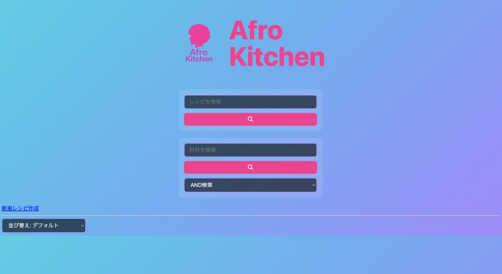
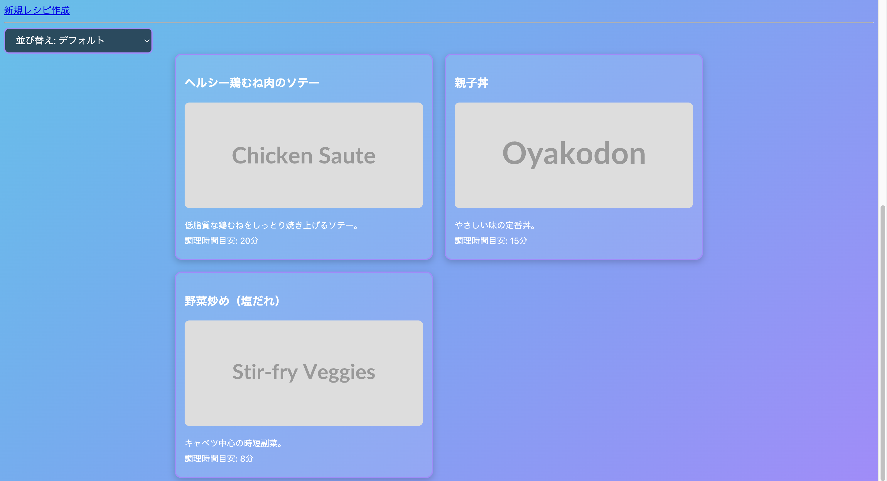
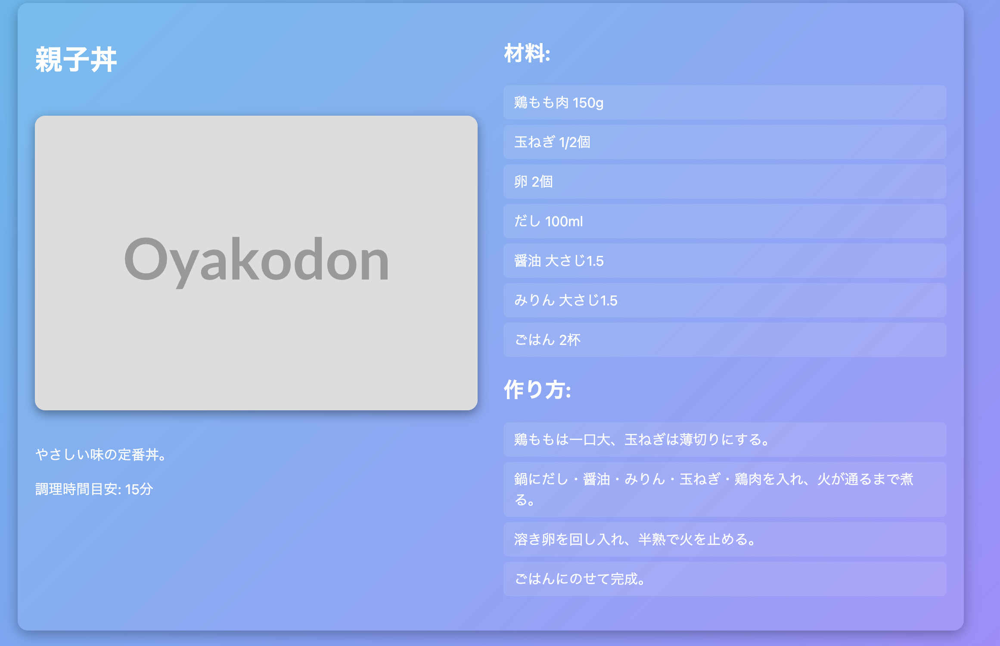

# Afro Kitchen


**アプリURL**：[https://recipe-app-0bse.onrender.com/](https://recipe-app-0bse.onrender.com/)
**GitHubリポジトリ**：[https://github.com/uk-python/recipe-app](https://github.com/uk-python/recipe-app)
## スクリーンショット



---

## 概要
本アプリは、ルームメイトの要望を元に作成した日々の家庭料理を簡単に記録・検索できるレシピ管理システムです。
特定の料理名だけでなく、材料からレシピを検索できる機能を備え、冷蔵庫の中身から献立を決めることが可能です。
バックエンドには Flask、データベースには SQLite を採用し、Ajax通信による非同期検索を実現しています。
また、UIはシンプルかつ直感的な操作性を重視しており、今後は買い物リスト生成やPFCバランス確認機能の実装も予定しています。

- **開発期間**：2025年9月（実質開発期間：約2週間）  
- **開発人数**：1名  
- **使用技術**：JavaScript / Python（Flask） / SQLite  
- **本番環境**：Render（無料プラン）

---

## 機能一覧

### 🔹 検索機能
- **レシピ名検索**：Ajax通信でページリロードなし  
- **材料検索**：AND / OR 条件切り替え対応  
- **結果並び替え**：調理時間順にソート  

### UI / UX
- 検索中にローディング表示  
- エラーメッセージを状況別に出し分け  
- 二重送信防止・入力欄の自動リセット  
- ベースカラーと余白を意識した基本的なデザイン  

---

## エラーハンドリング（5段階の検知と対応）

| No | 種類 | 内容 | 対応方法 |
|----|------|------|-----------|
| 1 | **入力値エラー** | 空欄・全角スペースなどの無効入力 | アラート表示＋処理中断 |
| 2 | **通信エラー** | サーバー未接続・ネットワーク不良 | catch節で再試行案内 |
| 3 | **サーバーエラー** | ステータスコード500系 | ステータス判定でメッセージ分岐 |
| 4 | **検索結果0件** | 条件に一致するレシピが無い | 「該当なし」メッセージ表示 |
| 5 | **二重送信** | ボタン連打による重複処理 | ボタンを自動無効化 |

---

## 技術的工夫

### Ajax通信の実装例
```javascript
fetch('/api/search', {
  method: 'POST',
  headers: { 'Content-Type': 'application/x-www-form-urlencoded' },
  body: 'query=' + encodeURIComponent(inputName)
});
```

## API設計
- **POST /api/search**：レシピ名検索  
- **POST /api/search_by_ingredients**：材料検索  
- **GET /api/recipes/{id}**：詳細ページ取得  

---

## バックエンド構成
- FlaskでルーティングとDBアクセスを分離  
- SQLiteを軽量データベースとして使用  
- RESTful API設計で拡張性を意識  

---

## 開発背景
* 現在ルームシェアをしており、私が毎日ご飯（弁当と夕食）を作っていました。
   * もうすぐルームシェアを解散し、ルームメイトは初めての一人暮らしを始めます。
   * 彼が「今までの料理がおいしかったから同じように作りたい」と言ってくれましたが、私は普段レシピを見て料理しないため記録が残っていませんでした。
   * そこで「自分の作った料理をレシピとして残し、再現できるようにする」ことを目的に、このアプリを開発しました。

---

## 今後の改善予定
ルームメイトから以下のリクエストがあり、今後の機能追加を計画しています。
      * **買い物リスト機能**：自炊初心者でも「何を買えば良いか」がすぐにわかる
      * **PFC確認機能**：筋トレをしているため、栄養バランスをすぐ確認したい

---

## 反省・今後の改善

### 1. 開発・運用面
- 一部のコミットがまとめて行われ、メッセージも抽象的だった。  
　→ 今後は **毎日コミット** を心がけ、  
　　「どの機能を、なぜ、どう改善したのか」が一目で分かるように記述する。

### 2. 技術面
- **コード構成**：ファイルの責務をより明確に分ける（API / HTML / JS）。  
- **エラーハンドリング**：ユーザーに伝わるメッセージ表示を整理。  
- **UI 改善**：検索結果の見やすさとボタン配置の統一感を向上させる。  
- **今後**：TypeScript / React の導入を見据え、モジュール化を意識してコードを再設計。

### 3. 学び
- Ajax 実装を通じて「非同期処理の流れとエラー対応の重要性」を体感。  
- 小さく動く単位で開発・デバッグすることの大切さを学んだ。